# ESP32 HID Keystroke Emulator ⌨️🤖

[]()
[](https://www.espressif.com/en/products/socs/esp32)
[](https://isocpp.org/)
[]()

> **Developed as part of a Research Internship at the Indian Institute of Information Technology (IIIT), Lucknow.**

> [!WARNING]
> **STRICT LEGAL & ETHICAL DISCLAIMER**
> 
> This project and its source code are provided strictly for **educational, academic, and research purposes only**. 
> 
> **DO NOT** use this hardware or software for any unauthorized, malicious, or illegal activities. Specifically, **any use of this tool for Online Assessment Systems (OAS), academic dishonesty, or cheating in online exams is strictly prohibited.**
> 
> This also includes unauthorized credential stuffing or bypassing security controls without explicit administrative consent.

---

An advanced USB HID keyboard emulator built on the ESP32 microcontroller. Unlike standard Rubber Ducky scripts that inject payloads at maximum speed, this project synthesizes highly realistic, human-like typing patterns using statistical distributions to bypass basic liveness detection and heuristic security systems. 

This hardware was specifically engineered to generate the adversarial "bot" dataset for the research publication: **"Human vs Bot: Detecting Automated Typing Patterns."**

## 🚀 Features

* **Statistical Timing Emulation:** Samples key dwell (hold) and inter-key flight times from Gaussian and Log-normal distributions based on real human typing data.
* **Variable Typing Speed:** Configurable Words-Per-Minute (WPM) settings.
* **Error & Correction Simulation:** Randomly injects typos, backspaces, and corrections to mimic human error rates.
* **Cognitive Pauses:** Introduces long pause durations (>500ms) to simulate "thinking" intervals during free-form text entry.
* **Plug-and-Play HID:** Acts as a standard USB keyboard on any target machine (Windows/Mac/Linux) without requiring custom drivers.

## 📡 How It Works (Workflow Animation)



## 🛠️ Hardware Requirements

* **ESP32 Development Board** (Must support USB HID, e.g., ESP32-S2, ESP32-S3, or standard ESP32 with appropriate USB stack/firmware).
* Micro-USB or USB-C cable (data capable).
* Target PC for injection.

## 💻 Getting Started

### Prerequisites
* [Arduino IDE](https://www.arduino.cc/en/software) or [PlatformIO](https://platformio.org/).
* ESP32 Board Manager installed in your IDE.

### Installation & Flashing
1. Clone this repository:
```bash
   git clone [https://github.com/poshithNandyala/esp32.git](https://github.com/poshithNandyala/esp32.git)
